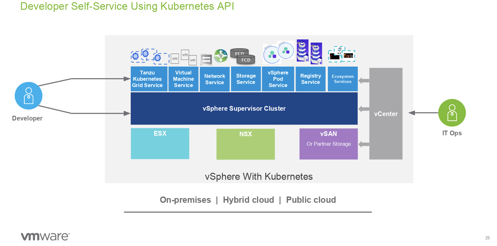
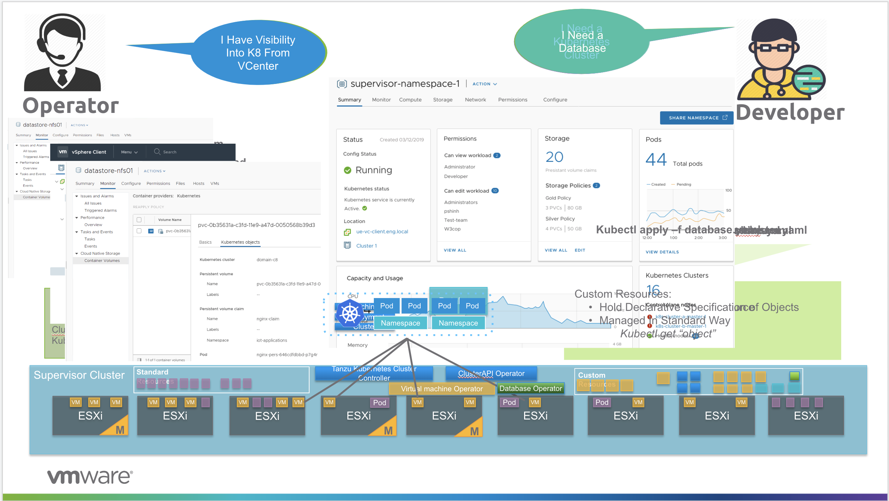

# Kubernetes on vSphere Lab

# Business Context:
TODO

### VI Admin Persona:

TODO

### Developer's Persona:

TODO

# Steps:

### CLIs
> 1. kubectl
> 2. tmc
> 3. helm 3

## 1. Installation

> 1. [Nested Install](./nestedinstall)
> 2. [Request OneCloud setup if needed](./onecloud)

## 2. Supervisor Cluster

> 	1. [Enable Supervisor Cluster](./supervisorcluster/enablecluster)
> 	2. [Enable Harbor](./supervisorcluster/enableharbor)
> 	3. [Enable access control](./supervisorcluster/accesscontrol)
> 	4. [Enable access control](./supervisorcluster/accesscontrol)
> 	5. [Enable access control](./supervisorcluster/accesscontrol)
> 	6. [Access Supervisor Cluster](./supervisorcluster/accesscluster)

## 3. Application Catalog Cluster

> 1. [Create Service Cluster](./servicecluster/createservicecluster)
> 2. [Attach to TMC](./servicecluster/attachclustertotmc)
> 3. [Integrate Application Catalog](./servicecluster/integrateapplicationcatalog)
> 4. [Install Elastic Search and Kibana](./servicecluster/EK)
> 5. [Install Wavefront](./servicecluster/wavefront)

## 4. Workload Cluster

> 1. [Create Workload Cluster](./workloadcluster/createworkloadcluster)
> 2. [Attach to TMC](./workloadcluster/attachclustertotmc)
> 3. [Install Fluent Bit](./workloadcluster/logging)
> 4. [Install Wavefront](./workloadcluster/wavefront)
> 5. [Deploy wordpress](./workloadcluster/deployworkloads)
