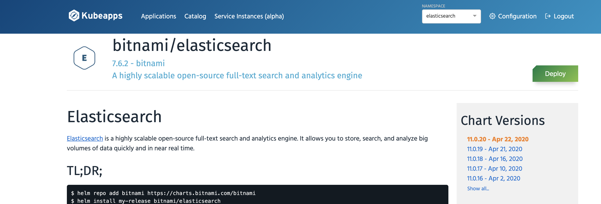
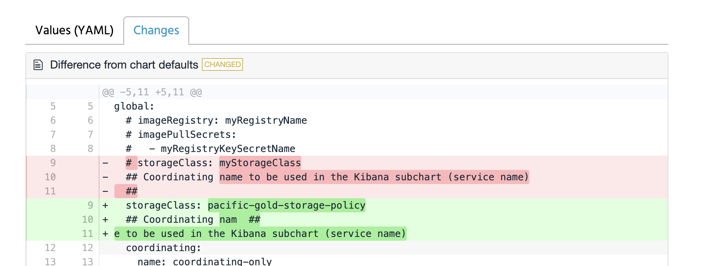
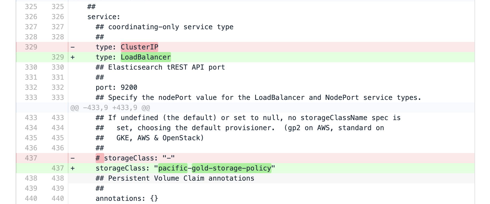
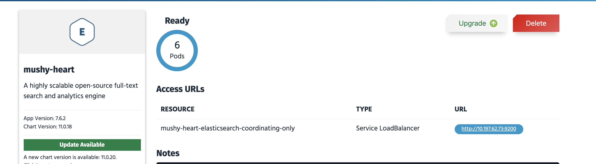
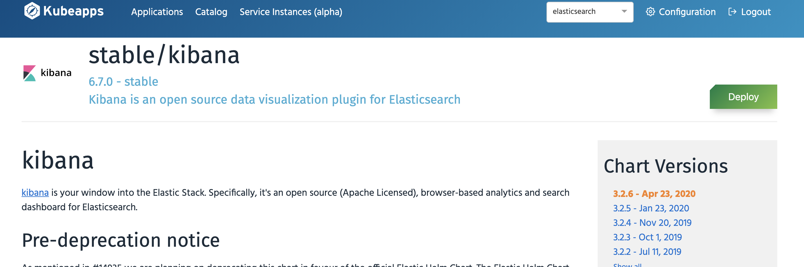
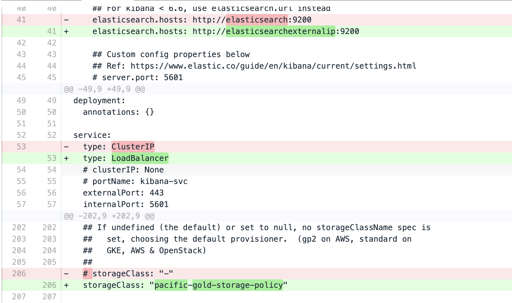
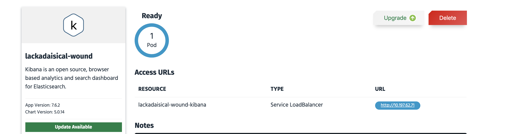
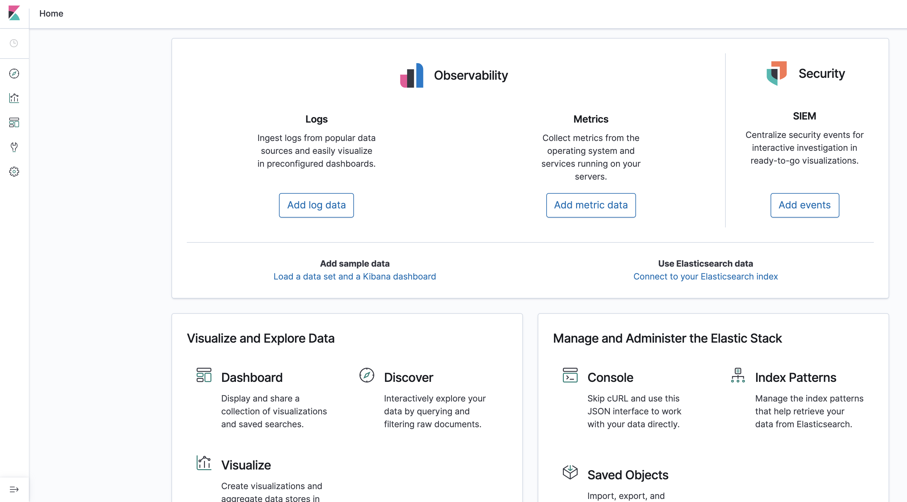
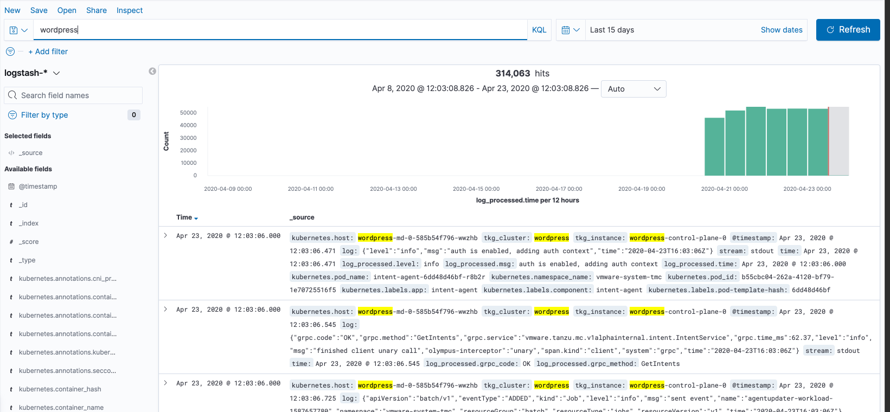

# Deploy Elastic Search and Kibana using Kubeapps.

Login to kubeapps. You can get its ip from application catalog service. You need to login as admin in kubeapps to get secret.

```bash
kubectl vsphere login --insecure-skip-tls-verify --managed-cluster-name=application-catalog --server wcp.haas-435.pez.pivotal.io -u alana@vsphere.local

kubectl get secret $(kubectl get serviceaccount kubeapps-operator -o jsonpath='{range .secrets[*]}{.name}{"\n"}{end}' | grep kubeapps-operator-token) -o jsonpath='{.data.token}' -o go-template='{{.data.token | base64decode}}' && echo

Get the Service ip and paste it in browser and use admin user. Let's use the token we got from the last command to access kubeapps.
kubectl -n kubeapps get svc kubeapps
```

#### Search ElasticSearch in Catalog and Click Deploy.


#### Make following changes according to your enviornment. Make sure to replace all occurance of storageclass with the one you created and click submit.





### You Should see 6 PODs up and running with an external ip that we need to use.



# Deploy Kibana

#### Search Kibana in Catalog and Click Deploy.



#### Make following changes according to your enviornment. Make sure to replace all occurance of storageclass with the one you created and click submit.






### You should see an external ip. Try accessing it using your browser!.



#### Create an index using pattern logstash-* and use filter @timestamp. Once done you should see all logs from Fluent-bit that we have configured on workload cluster.



