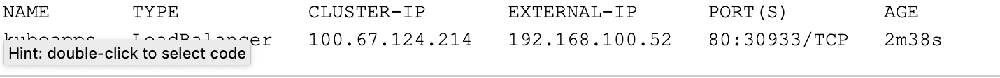
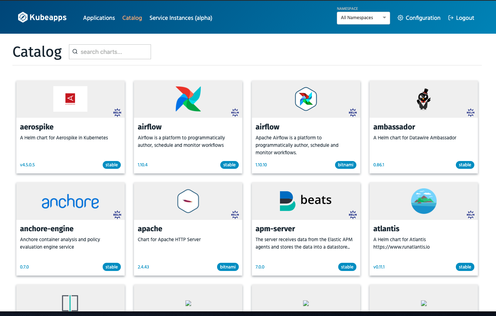

# Application Catalog

```bash
kubectl create namespace kubeapps
helm repo update
helm repo add bitnami https://charts.bitnami.com/bitnami
helm install kubeapps bitnami/kubeapps -n kubeapps --set useHelm3=true --set frontend.service.type=LoadBalancer
kubectl -n kubeapps get svc kubeapps
```


Kubeapps Access Control can be configured according to your needs but we will not dive into this topic here and just configure admin access.

```bash
kubectl create serviceaccount kubeapps-operator
kubectl create clusterrolebinding kubeapps-operator --clusterrole=cluster-admin --serviceaccount=default:kubeapps-operator
kubectl get secret $(kubectl get serviceaccount kubeapps-operator -o jsonpath='{range .secrets[*]}{.name}{"\n"}{end}' | grep kubeapps-operator-token) -o jsonpath='{.data.token}' -o go-template='{{.data.token | base64decode}}' && echo
```

Get the Service ip and paste it in browser and use admin user. Let's use the token we got from the last command to access kubeapps.

