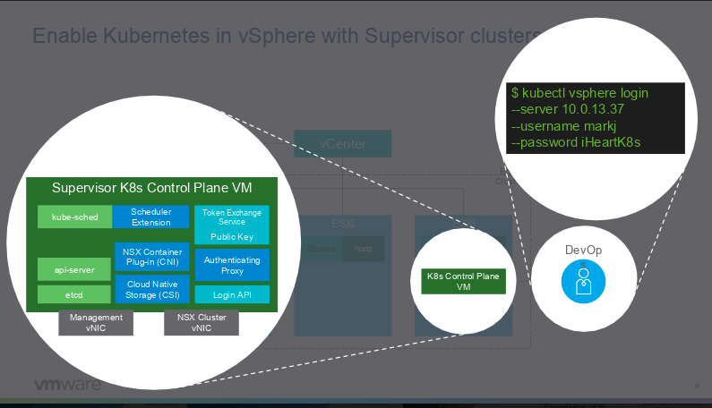
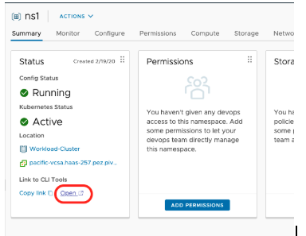
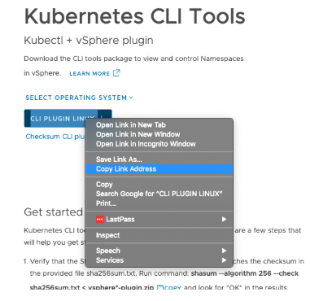
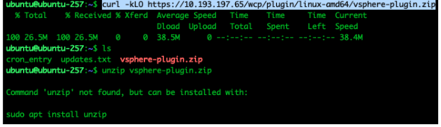
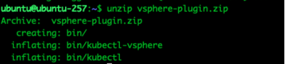
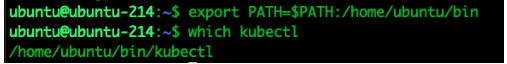
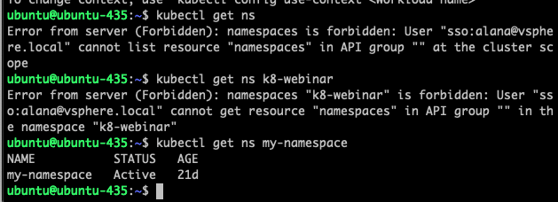

# Access SupervisorCluster



If you are using a jumpbox then ssh into the jumbox to access clusters.
ssh ubuntu@ip

Install kubcetl to your linux/mac path





```bash
From your ubuntu Jumpbox curl -kLO <Copied link address>
Install unzip to unzip file
sudo apt install unzip
```



```bash
unzip the vsphere-plugin file
unzip vsphere-plugin.zip
```



Put the contents of the .zip file in your OS's executable search path.
Note: If you are NOT using the Ubuntu jumpbox, and are using your MAC directly, you may run into issues running the below export command. Reason being,  if  kubectl is already in your PATH from before, it will pick that one instead of the PATH of the downloaded ZIP, which is needed for this exercise. If you are using your MAC, then place the ZIP contents in the beginning of your PATH rather than at the end to avoid any conflicts. 

```bash
export PATH=/some/new/path:$PATH
Adding a Path to the Linux PATH Variable
Everything You Need to Know About $PATH in Bash

export PATH=$PATH:/home/ubuntu/bin
which kubectl
```



Using Alana User:

```bash
Run command: kubectl vsphere login --insecure-skip-tls-verify --server your-wcp-server -u alana@vsphere.local
to log in to server. Use wcp IP or hostname that you have configured. User your admin credentials
You can also use administrator@vsphere.local user.

Username: alana@vsphere.local
PW: VMware1!
```

We have given Alana user 'Can Edit' role. One thing to notice here that Alana user can only access its own namespace. If you try to execute kubectl get ns command it will give access denied error but admin user should be able to see all namespaces.




