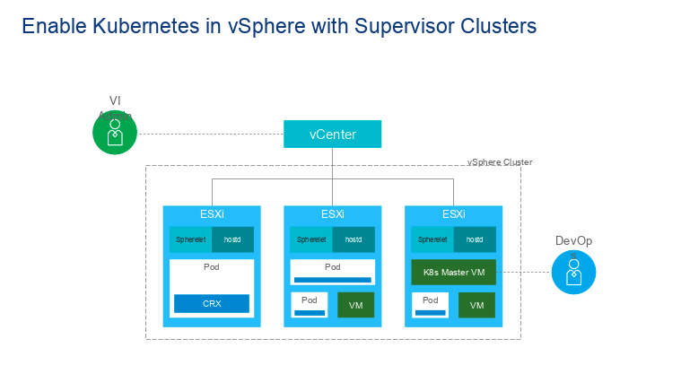
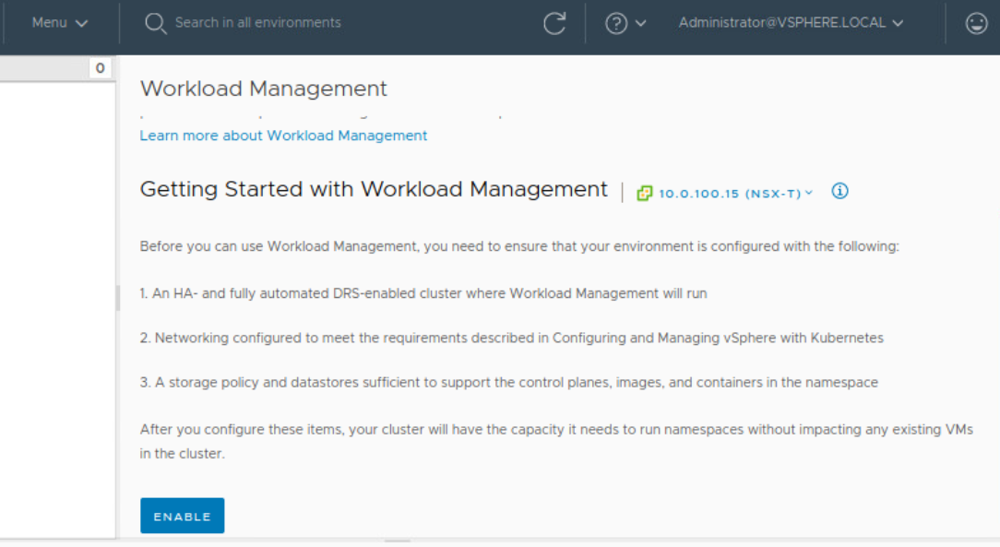
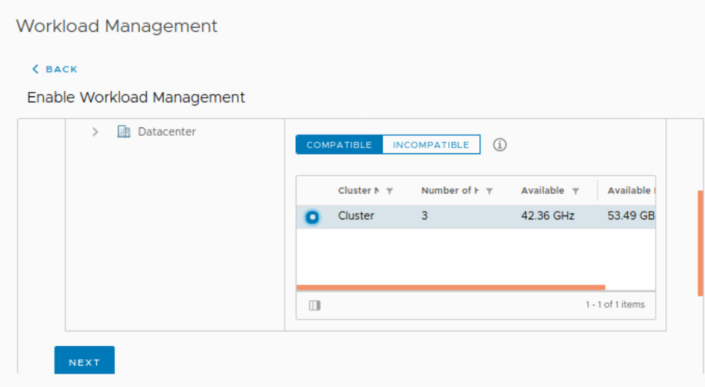
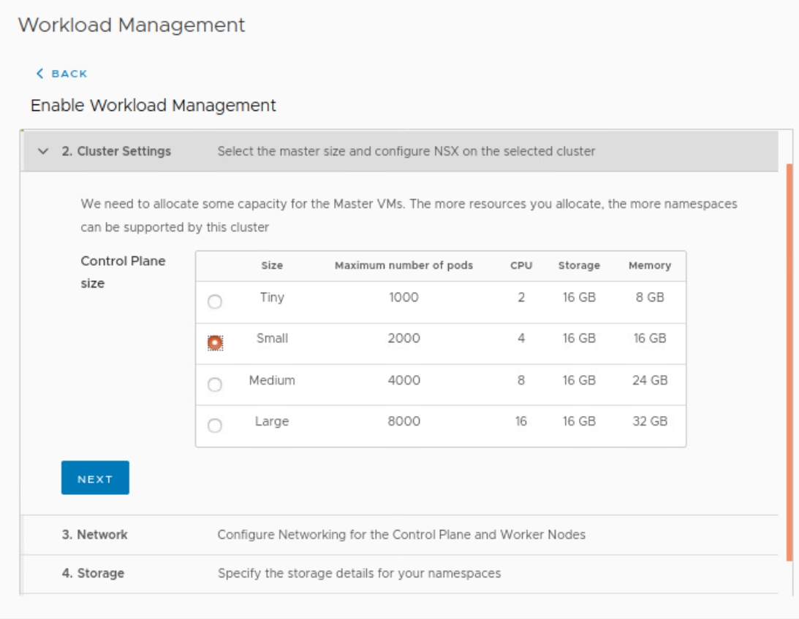
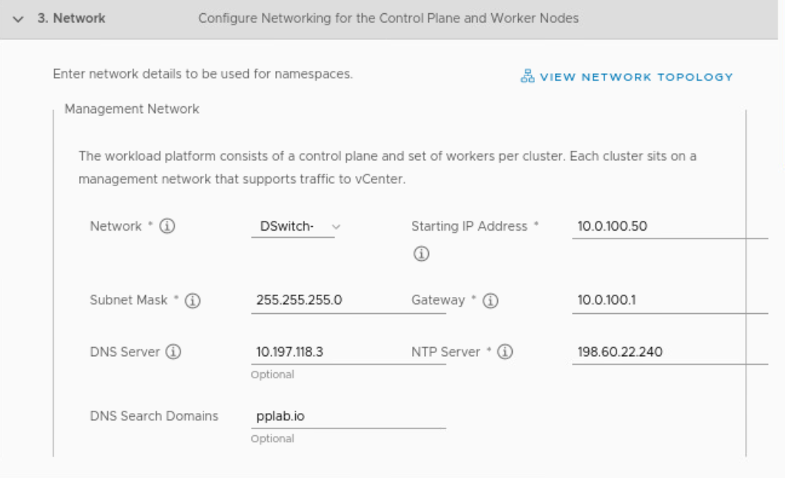
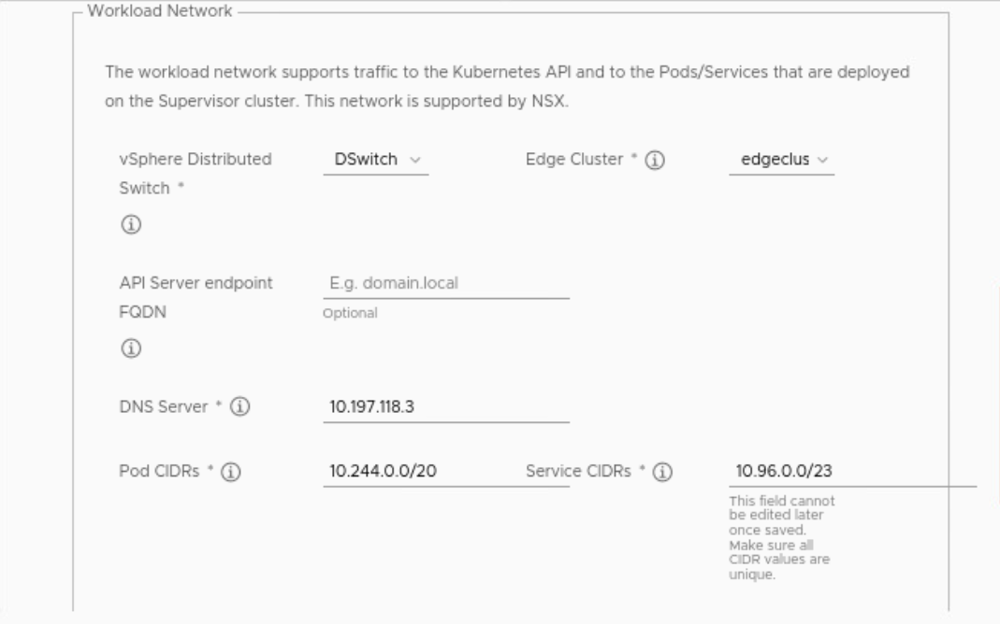
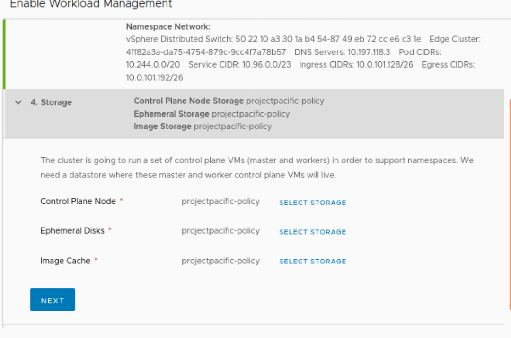
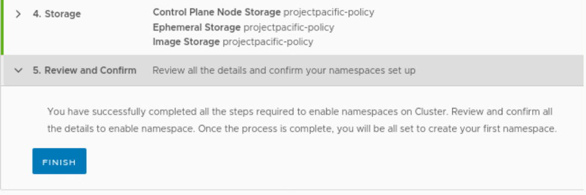
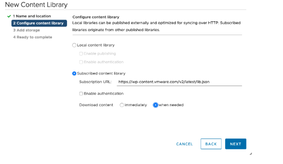
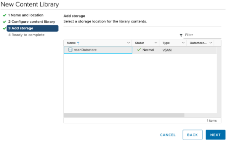

# Enable Supervisor Cluster

Menu > Workload Management > Enable

``Below configurations should be according to your enviornment``

``Network: Management Network``

``Subnet Mask: 255.255.255.0``

``Starting IP: 10.###.###.45``

``Gateway: 10.###.###.1``

``DNS Server: 10.192.2.10``

``NTP: 10.192.2.5``

``DNS Search Domain: pplab.io``

``vSphere Distributed Switch: choose default (UUID)``

``Edge Cluster: Edge-Cluster-01``

``Ingress CIDR: 10.###.###.64/26``

``Egress CIDR: 10.###.###.128/26``

THIS STEP TAKES ABOUT 20-30min. IT DOES FAIL AT TIMES AND YOU MAY NEED TO REMOVE WORKLOAD MANAGEMENT, AND DO THIS STEP OVER.

## To store the Guest Cluster Images we will need to create a Content Library.

1. Navigate to Menu -> Content Libraries -> Create
2. Set name as Kubernetes (case sensitive)
3. Choose Subscribed Content Library and enter in https://wp-content.vmware.com/v2/beta/lib.json for the URL, and choose when needed

4. Click Yes to accept the certificate thumbprint.

5. Choose a datastore to store your images.
6. Click Finish
