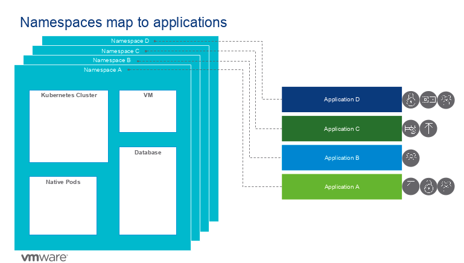
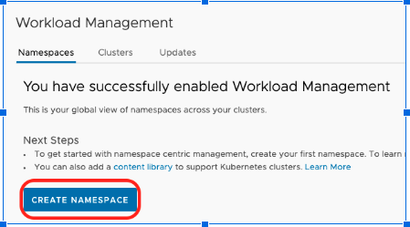
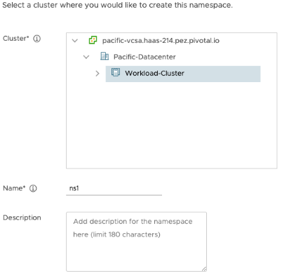
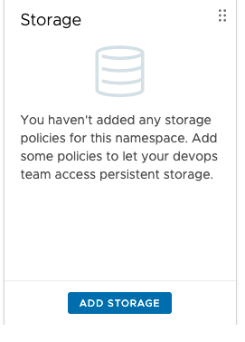
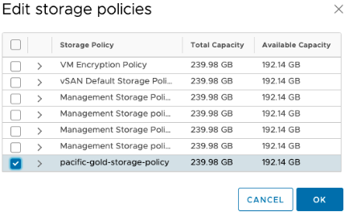
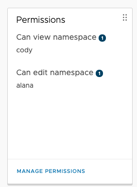
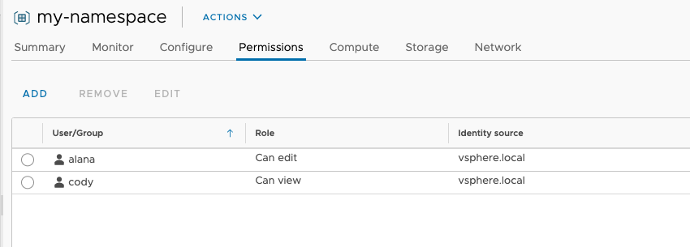
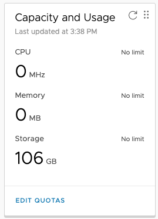
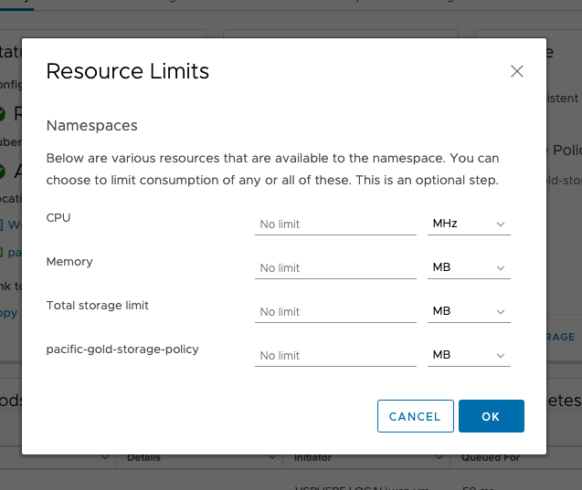

# Create Namespace

Once Supervisor Cluster is enabled then we need to create a namespace. Vi Admins are going to create this namespace per product team. Vi admin can provide access to this namespace to dev teams and also apply storage and quota polices. Name your workspace as vsphere-k8-hol.

## Storage

`Choose your storage policy.`

## Manage Permission

Assging 'can edit' role to Alana and 'can view' role to cody.

 

## Resource Limits

You can also assign resouce limits.

