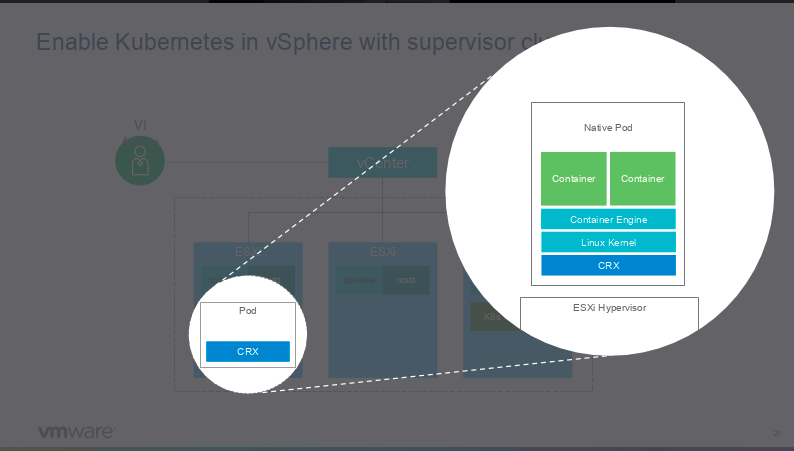
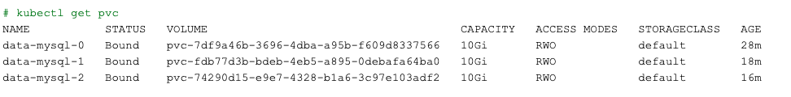
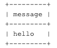
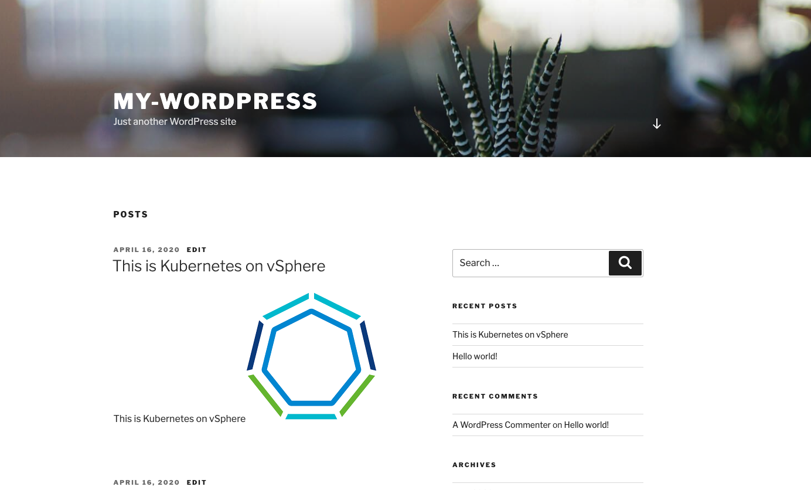

# Native Pod



## Replace or add your storage class in yaml files that you have created for PVC before you execute any scripts.

Switch your context to the namespace you have created.

`kubectl config use-context my-namespace`

## Deploy MySql

```bash
kubectl apply -f scripts/mysql

kubectl get pods -l app=mysql
```



kubectl get pvc


```bash
kubectl run mysql-client --image=mysql:5.7 -i --rm --restart=Never -- mysql -h mysql-0.mysql <<EOF
CREATE DATABASE test;
CREATE TABLE test.messages (message VARCHAR(250));
INSERT INTO test.messages VALUES ('hello');
EOF

kubectl run mysql-client --image=mysql:5.7 -i -t --rm --restart=Never -- mysql -h mysql-read -e "SELECT * FROM test.messages"

```



`kubectl delete -f scripts/mysql`

## Deploy Wordpress

```bash
kubectl apply -f scripts/wordpress/deployment.yaml
kubectl get svc
```


Grab external ip and access via browser. 


