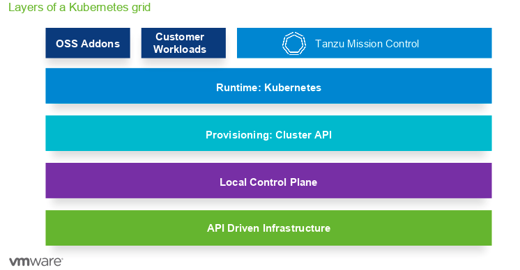
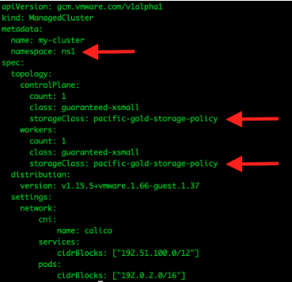

# Workload Cluster



## Create Workload Cluster

Login as admin.
```bash
kubectl vsphere login --insecure-skip-tls-verify --server your-wcp-server -u alana@vsphere.local
```

Username: alana@vsphere.local
PW: VMware1!

Switch to the namespace we created.
`
kubectl config use-context <namespace>
`

Make sure to use the correct Storage Class that you created and Namespace in the manifest file.



`
kubectl apply -f scripts/create-managed-cluster.yaml
`

SOMETIMES THE GUEST CLUSTER DOES NOT SHOW UP IN THE VSPHERE UI. 
YOU MAY HAVE TO DELETE AND DO IT AGAIN.

kubectl config use-context guestcluster