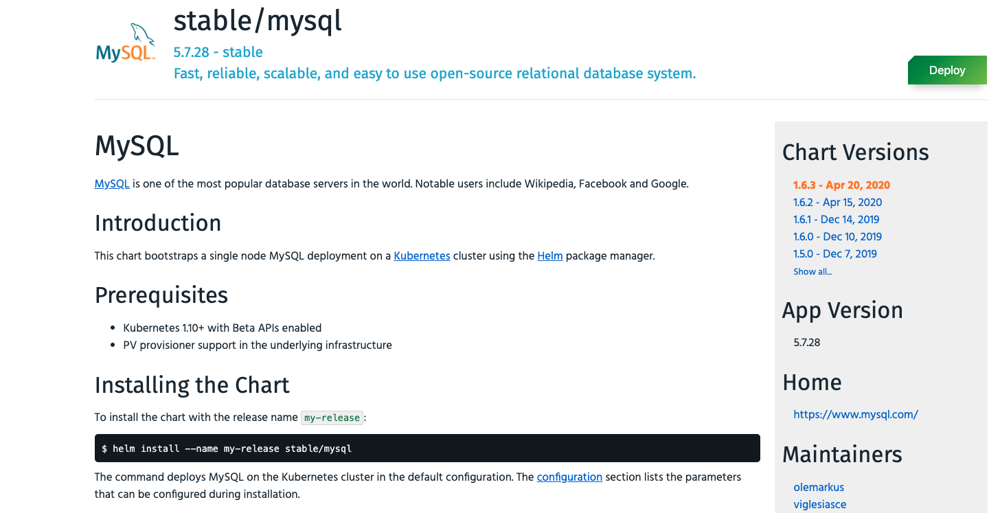
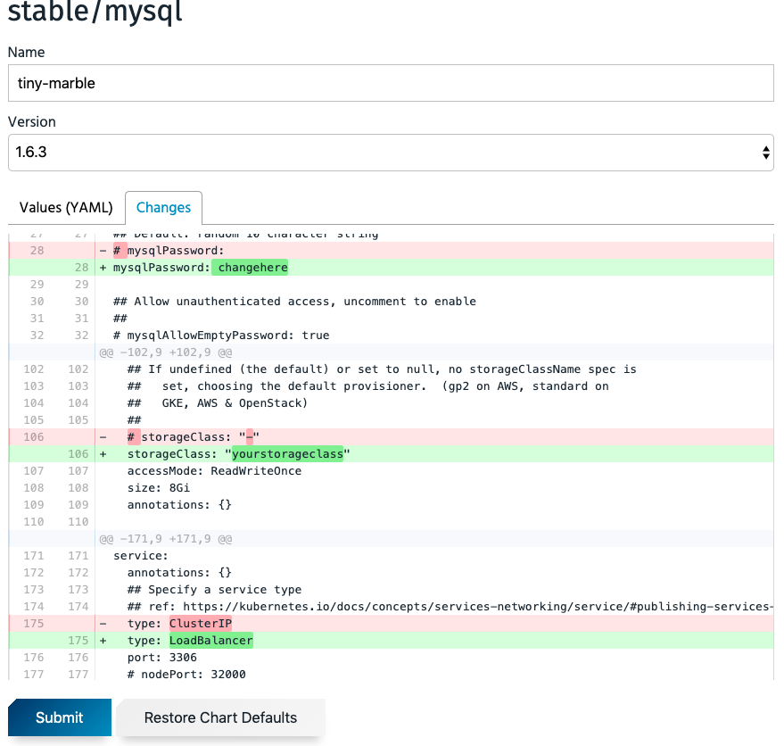
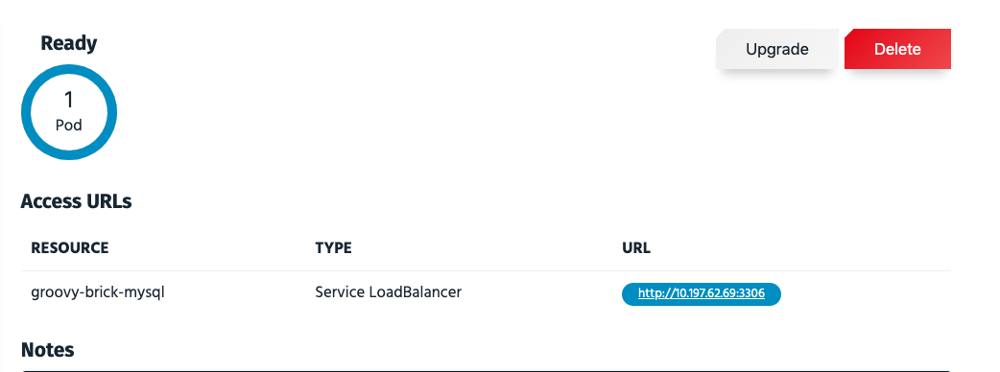
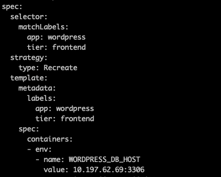

# Deploy Wordpress App

Wordpress needs a MySql database. We will create a mysql database using Tanzu Application Catalog. Mysql will be deployed in Application Catalog Cluster. Once deployed we can get its external ip and use it in wordpress deployment.

##### Login to KubeApps. Dev Team should have view rights on Application catalog cluster.

# Deploy Mysql

```bash
kubectl vsphere login --insecure-skip-tls-verify --managed-cluster-name=application-catalog --server wcp.haas-435.pez.pivotal.io -u cody@vsphere.local
```

Access Kubeapps. Search MySql from catalog and click Deploy.

#### Change Storage class according to your env. kubectl get storageclasses
#### Change Service as LoadBalancer
#### Change root mysql password: cat scripts/wordpress/kustomization.yaml and copy mysql password.







Change Namespace from top menu and select mysql.

Click Submit.

Login as Cody on application catalog cluster:

```bash
vsphere login --insecure-skip-tls-verify --managed-cluster-name=application-catalog --server wcp.haas-435.pez.pivotal.io -u cody@vsphere.local
kubectl config use-context application-catalog
kubectl get svc -n mysql

Login as Cody on Wordpress cluster:

vsphere login --insecure-skip-tls-verify --managed-cluster-name=wordpress --server wcp.haas-435.pez.pivotal.io -u cody@vsphere.local
```

# Deploy Wordpress

##### Get MySql External IP. You can get it from Application Catalog and using Kubectl get svc on Application Catalog cluster. Replace WORDPRESS_DB_HOST value in deployment-app-catalog.yaml.



```
kubectl apply -f scripts/wordpress/deployment-app-catalog.yaml

```

